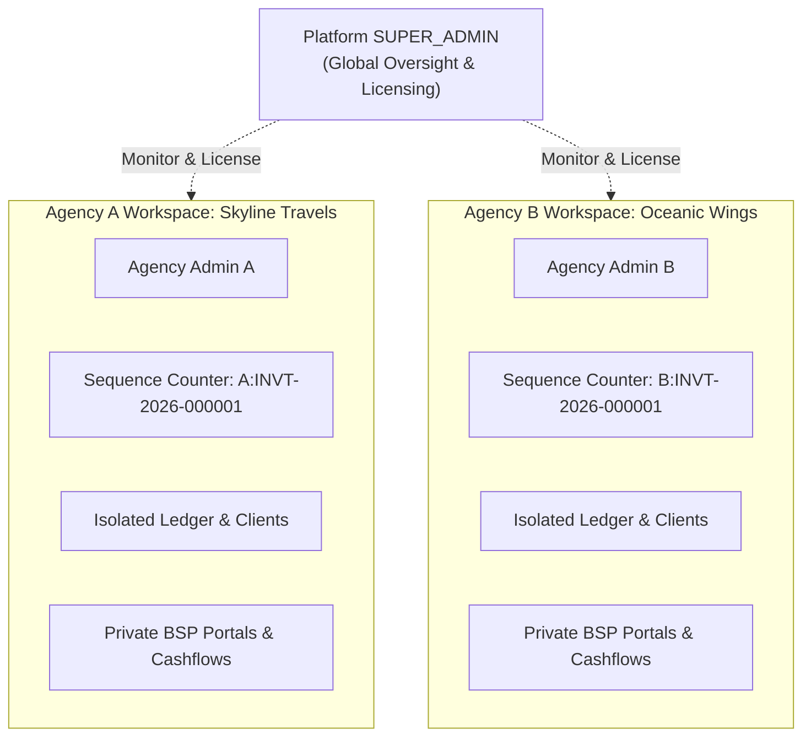

# AeroDesk
### Enterprise Multi-Tenant Travel & Aviation Agency Management ERP

[](https://aero-desk-erp.vercel.app)


**Live Application**: [https://aero-desk-erp.vercel.app](https://aero-desk-erp.vercel.app)  

---

**AeroDesk** is an enterprise multi-tenant cloud ERP engineered specifically for Travel & Aviation agencies, ticketing consolidators, and visa brokers. It features atomic double-entry bookkeeping, prepaid GDS/BSP portal wallet tracking, consolidator payable credit lines, printable money receipts, a self-healing ledger, and **document-level multi-tenant isolation** allowing thousands of agencies to run securely on a single unified platform.

---

## Multi-Tenancy Architecture (Tenant Isolation)

AeroDesk implements **Row/Document-Level Multi-Tenancy** with compound indexing and strict request-level scoping:



### Isolation Guarantees:
- **Zero Cross-Tenant Leakage**: Every transaction, client, supplier, receipt, expense, audit log, and setting is tagged with an immutable `agency` ObjectId.
- **Independent Sequence Numbers**: Each agency's invoice and receipt sequence counters run independently (`${agencyId}:${prefix}-${year}`). Multiple agencies can issue `INVT-2026-000001` simultaneously without index collisions.
- **Compound Uniqueness**: Clients and suppliers with identical names can exist across different agencies without conflict via `{ agency: 1, name: 1 }` indexing.
- **Isolated Balance Recalculation**: Running ledger health recalculation in one agency strictly replays transactions for that agency and never touches another agency's balances.
- **Global + Agency-Scoped Master Data**: Airlines and flight sectors support global shared defaults (`agency: null`) alongside agency-custom routes.

---

## Role-Based Access Control (RBAC)

AeroDesk separates platform governance from agency operations:

| Role | Scope | Description |
|---|---|---|
| **`SUPER_ADMIN`** | **Platform Owner Only** | Platform master account. Oversees all agencies, inspects global metrics, activates/suspends delinquent tenants. Not tied to any single agency. |
| **`ADMIN`** | **Agency Level** | Agency Owner / Director. Full control over their agency's staff, clients, suppliers, invoices, and ledger recalculation. |
| **`MANAGER`** | **Agency Level** | Operations & Finance Manager. Can issue invoices, collect receipts, view reports, top-up wallets, and make payments. |
| **`STAFF`** | **Agency Level** | Front-desk & Ticketing Staff. Can create invoices, collect money receipts, and view operational dashboards. |

### Feature Permissions Matrix

| Feature / Resource | STAFF | MANAGER | ADMIN | SUPER_ADMIN |
|---|:---:|:---:|:---:|:---:|
| View Agency Dashboard | ✅ | ✅ | ✅ | ✅ |
| Issue Ticket & Visa Invoices | ✅ | ✅ | ✅ | ❌ |
| Collect Client Money Receipts | ✅ | ✅ | ✅ | ❌ |
| View General Ledger | ✅ | ✅ | ✅ | ❌ |
| Top-up Portal & Pay Agency | ❌ | ✅ | ✅ | ❌ |
| Void Transactions | ❌ | ❌ | ✅ | ❌ |
| View Financial Profit Reports | ❌ | ✅ | ✅ | ❌ |
| Recalculate Agency Balances | ❌ | ❌ | ✅ | ❌ |
| Manage Agency Settings & Staff | ❌ | ❌ | ✅ | ❌ |
| View Agency Audit Logs | ❌ | ❌ | ✅ | ❌ |
| **Manage All Agencies & Licenses** | ❌ | ❌ | ❌ | ✅ |
| **Suspend / Activate Agency Workspaces** | ❌ | ❌ | ❌ | ✅ |

> **Security Note:** Regular agency admins cannot create or elevate anyone to `SUPER_ADMIN`. The API hard-sanitizes role creation to prevent privilege escalation.

---

## Default Credentials

### 1. Platform Root Super Admin *(Platform Owner)*
- **Role:** `SUPER_ADMIN`
- **Email:** `superadmin@aerodesk.com`
- **Password:** `superadmin123`

### 2. Demo Agency Admin *(Sample Agency Workspace)*
- **Agency:** Skyline Travels & Tours (`skyline-travels`)
- **Role:** `ADMIN`
- **Email:** `admin@aerodesk.com`
- **Password:** `admin123`

---

## Self-Service Agency Onboarding

New travel agencies can register their own dedicated workspace via:
- URL: **`/register`** or **`/signup`**
- Workflow:
  1. Agency registers trade name, hotline, and address.
  2. Sets up primary Administrator account.
  3. System automatically provisions agency workspace, in-house stock supplier (`IN-HOUSE / OWN STOCK`), default chart of expense categories, and localized company profile.
  4. Instant login to the isolated agency workspace.

---

## Key ERP Features

### 1. Air Ticketing & Multi-Pax Invoicing
- **Multi-passenger batch invoicing**: Issue tickets for families and corporate groups in a single transaction with individual passenger names, ticket numbers, PNRs, routes, buy prices, and sell prices.
- **Dynamic profit calculations**: Automatic real-time cost, sell, and net margin computation.
- **Real-time balance adjustments**: Instantly increases client outstanding due and automatically draws down from the selected BSP/GDS portal wallet or consolidator credit line.

### 2. Visa Processing & Service Fees
- Comprehensive visa invoice workflow with case tracking, embassy visa fees, service charges, cost price vs sell price margins, and passenger-level records.

### 3. Money Receipts & Client Accounts Receivable
- Collect payments across multiple payment channels: **Cash, Bank Transfer (NPSB / BEFTN / RTGS), Cheques, Cards / POS, Mobile Banking (bKash / Nagad / Rocket)**.
- **Printable Money Receipts**: Standardized vouchers with words conversion (`Taka Ten Thousand Only` / Lakh / Crore formatting).
- Automatic reduction of client outstanding receivables with real-time running balance recalculation.

### 4. Suppliers: BSP Portals & Consolidators
- **Prepaid Portal Wallets**: Track real-time balances of top-up accounts (e.g., Sabre, Amadeus, Galileo, Flyhub, ShareTrip).
- **Consolidator Agency Credit Lines**: Track payable dues and credit limits for credit-line consolidators.
- **In-House / Direct Inventory Stock**: Support for airline direct-allocated inventory with zero liability accounting.
- **ADM & ACM Tracking**: Agency Debit Memos and Agency Credit Memos for airline penalty and rebate adjustments.

### 5. Immutable General Ledger & Self-Healing
- Complete financial record of every transaction: Invoices, Receipts, Top-ups, Payments, Expenses, and Memos.
- **Voiding with Audit History**: Safely void erroneous transactions with mandatory audit reasons and automatic ledger reversals.
- **Self-Healing Balances**: One-click recalculation tool that audits the raw transaction ledger and repairs any out-of-sync client dues or supplier balances.

---

## Quick Start (Local Development)

### 1. Clone the repository
```bash
git clone https://github.com/ZUNA1D/AeroDesk-ERP.git
cd AeroDesk-ERP
```

### 2. Configure Environment Variables

**Backend (`backend/.env`):**
```env
PORT=5000
MONGODB_URI=mongodb://localhost:27017/AeroDesk_db
JWT_SECRET=super_secret_jwt_key_aerodesk_2026
JWT_EXPIRES_IN=7d
FRONTEND_ORIGIN=http://localhost:5173
UPLOAD_DIR=./uploads
```

**Frontend (`frontend/.env`):**
```env
VITE_API_BASE_URL=http://localhost:5000/api
```

### 3. Install & Run
```bash
# Install dependencies across all workspaces
npm install

# Run backend (terminal 1)
npm run dev:backend

# Run frontend (terminal 2)
npm run dev:frontend
```

Visit **http://localhost:5173** in your browser.

### 4. Seed Data & Super Admin
To populate the Super Admin, demo agency workspace, portal wallets, and global catalogs:
```bash
cd backend
npm run seed
```

To create or reset Super Admin credentials on demand:
```bash
cd backend
npm run create:superadmin your-email@domain.com YourPassword "Your Name"
```

### 5. Running Automated Tests
Execute the full test suite (accounting balance integrity + multi-tenant isolation):
```bash
cd backend
npm test
```

---

## Tech Stack

| Domain | Technology | Description |
|---|---|---|
| **Frontend Framework** | React 18 | Client application built with functional hooks & modern state management |
| **Build Tool** | Vite 6 | Lightning-fast HMR and optimized production bundle |
| **Styling** | Vanilla CSS + Tailwind CSS | Custom design tokens with automatic Light/Dark mode transitions |
| **Icons** | Lucide React | Clean, scalable vector icon library |
| **Data Fetching** | TanStack Query v5 | Server state caching, optimistic updates, and background refetching |
| **Backend Runtime** | Node.js (ES Modules) | Asynchronous backend services |
| **Web Framework** | Express 4 | Secure RESTful API with helmet, cors, and cookie-parser |
| **Database** | MongoDB & Mongoose 8 | Document database with atomic session transactions & compound indexes |
| **Authentication** | JWT (JSON Web Tokens) | Secure stateless authentication with multi-tenant claims |

---

## Repository Structure

```text
AeroDesk-ERP/
├── api/                       # Vercel serverless function entry point (api/index.js)
├── backend/                   # Express REST API, models, controllers, and services
│   ├── src/
│   │   ├── controllers/       # Handlers for ticketing, visas, ledger, users, agency, reports
│   │   ├── models/            # Mongoose schemas (Agency, Transaction, Client, Supplier, User)
│   │   ├── routes/            # REST API endpoints
│   │   ├── services/          # Multi-tenant onboarding, audit logging, counter, ledger math
│   │   └── server.js          # HTTP bootstrap server
│   ├── tests/                 # Accounting integrity & multi-tenancy test suites
│   └── package.json
├── frontend/                  # React 18 + Vite Single Page Application
│   ├── src/
│   │   ├── components/        # Reusable UI cards, tables, modals, layout
│   │   ├── pages/             # Dashboard, Register, Invoices, Visas, Ledger, Suppliers, Reports
│   │   └── index.css          # Design system & theme tokens
│   └── package.json
├── vercel.json                # Vercel full-stack routing & build rules
├── package.json               # Root monorepo workspace configuration
└── README.md
```

---

## License

This project is licensed under the **MIT License**. Free for personal and commercial travel agency operations.
